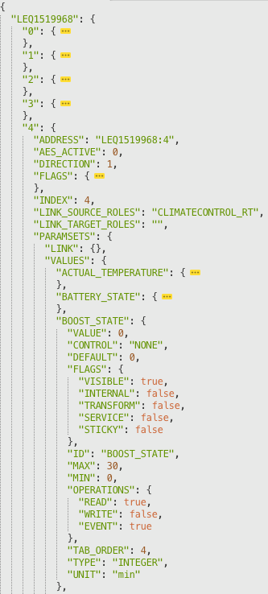

Uses Homematic XML-RPC API to collect paramsets and paramsetDescriptions from your CCU and stores it as JSON.  
Output will look like this:

This script uses `listDevices`, `getParamset` and `getParamsetDescription` to generate this output. The raw output from CCU will be reformatted and merged into one big JSON object (see above).

## Usage

### Native

	git pull https://github.com/dersimn/hmGetInfo
	cd hmGetInfo
	npm install
    mkdir output
	node index.js -c 10.1.1.150

For Homematic IP, just change the port:

	node index.js -c 10.1.1.150 -p 2010

### Docker

	docker run -it --rm -v $(pwd):/app/output dersimn/hmgetinfo -c 10.1.1.150
